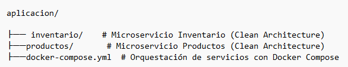
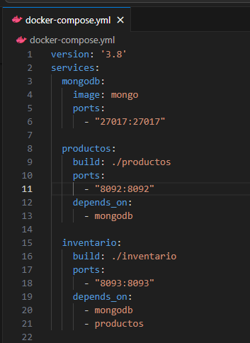
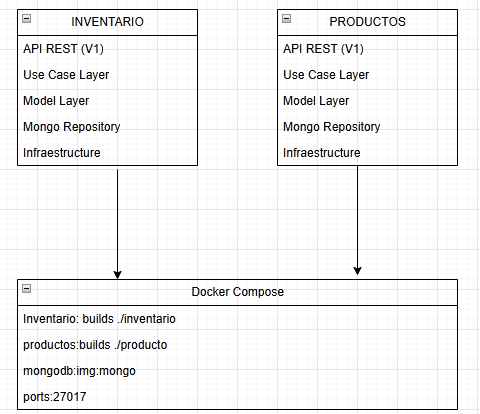

## Instruciones de Instalación y Ejecucion:

## Estructura del Proyecto:

## Requisitos previos

Antes de comenzar, asegúrate de tener instalado:

* Docker Desktop

* Java 17

* Gradle (opcional si vas a compilar manualmente)

* MongoDB Compass (opcional para visualizar datos)

## Paso 1 Crear los .jar de cada microservicio

Desde cada carpeta (inventario/ y productos/), ejecuta:

./gradlew clean build

## Paso2 Crear el Dockerfile en cada microservicio

inventario/Dockerfile

productos/Dockerfile

## Paso 3 Configurar docker-compose.yml
Ubicado en la raíz aplicacion/:

## Paso 4 Ajustar configuración en application.yaml
En inventario/src/main/resources/application.yaml

##  Paso 5 Ejecutar la aplicación
docker compose up --build

## Paso 6: Verificar funcionamiento
Swagger Productos: http://localhost:8092/swagger-ui/index.html

Swagger Inventario: http://localhost:8093/swagger-ui/index.html

MongoDB: [localhost:27017] (puedes usar Compass para conectarte)

## Descripcion breve de la arquitectura

Empezaremos por explicar los diferentes componentes del proyectos y partiremos de los componentes externos, continuando con los componentes core de negocio (dominio) y por �ltimo el inicio y configuraci�n de la aplicaci�n.

Lee el art�culo [Clean Architecture � Aislando los detalles](https://medium.com/bancolombia-tech/clean-architecture-aislando-los-detalles-4f9530f35d7a)

# Arquitectura

## Domain

Es el m�dulo m�s interno de la arquitectura, pertenece a la capa del dominio y encapsula la l�gica y reglas del negocio mediante modelos y entidades del dominio.

## Usecases

Este m�dulo gradle perteneciente a la capa del dominio, implementa los casos de uso del sistema, define l�gica de aplicaci�n y reacciona a las invocaciones desde el m�dulo de entry points, orquestando los flujos hacia el m�dulo de entities.

## Infrastructure

### Helpers

En el apartado de helpers tendremos utilidades generales para los Driven Adapters y Entry Points.

Estas utilidades no est�n arraigadas a objetos concretos, se realiza el uso de generics para modelar comportamientos
gen�ricos de los diferentes objetos de persistencia que puedan existir, este tipo de implementaciones se realizan
basadas en el patr�n de dise�o [Unit of Work y Repository](https://medium.com/@krzychukosobudzki/repository-design-pattern-bc490b256006)

Estas clases no puede existir solas y debe heredarse su compartimiento en los **Driven Adapters**

### Driven Adapters

Los driven adapter representan implementaciones externas a nuestro sistema, como lo son conexiones a servicios rest,
soap, bases de datos, lectura de archivos planos, y en concreto cualquier origen y fuente de datos con la que debamos
interactuar.

### Entry Points

Los entry points representan los puntos de entrada de la aplicaci�n o el inicio de los flujos de negocio.

## Application

Este m�dulo es el m�s externo de la arquitectura, es el encargado de ensamblar los distintos m�dulos, resolver las dependencias y crear los beans de los casos de use (UseCases) de forma autom�tica, inyectando en �stos instancias concretas de las dependencias declaradas. Adem�s inicia la aplicaci�n (es el �nico m�dulo del proyecto donde encontraremos la funci�n �public static void main(String[] args)�.

**Los beans de los casos de uso se disponibilizan automaticamente gracias a un '@ComponentScan' ubicado en esta capa.**

## Desiciones Tecnicas y Justificaciones

Decisión: Separar la aplicación en capas bien definidas: model, usecase, repository, api-rest, app-service.

Justificación:

Facilita la mantenibilidad y escalabilidad.

Permite que la lógica de negocio sea independiente de frameworks y tecnologías externas.

Mejora la testabilidad al desacoplar componentes.

Decisión: Crear dos microservicios separados: productos e inventario.

Justificación:

Permite escalar cada servicio de forma independiente.

Mejora la resiliencia: un fallo en productos no afecta inventario.

Facilita el despliegue y evolución de cada servicio por separado.

## Diagrama de iteracion entre servicios

